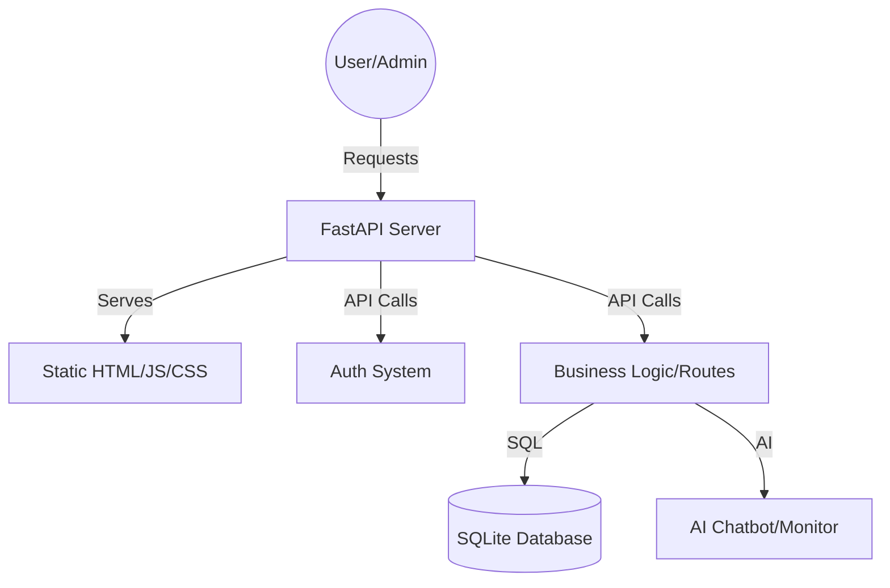

# 🥗 HealthBite Smart Canteen - Production Flow WIKI

Welcome to the official technical documentation for the HealthBite Smart Canteen system. This guide explains the architecture, data flow, and operational procedures of the application.

---

## 🏗️ System Architecture

The Smart Canteen is built as a **monolithic full-stack application** with a clear separation between the API layer and the presentation layer.

- **Backend**: Python FastAPI (High performance, asynchronous, type-safe API).
- **Frontend**: Vanilla HTML/JS/CSS (No heavy frameworks, served directly by the backend).
- **Database**: SQLite (Relational database for structured health and order data).

---

## ⚙️ Backend Workflow

### 1. Entry Point: `app.py`
The server initializes here. It performs several critical roles:
- **Table Creation**: Triggers `Base.metadata.create_all` to ensure the database schema is ready.
- **Router Registration**: Hooks up all sub-modules (Auth, Menu, Health, Analytics, etc.).
- **Static Mounting**: Configures FastAPI to serve the `frontend` folder files.
- **Catch-all Logic**: Implements a "Single Page App" behavior by serving `index.html` for unknown routes.

### 2. Authentication: `auth.py`
- **Security**: Uses `passlib (sha256)` for password hashing and `jose (JWT)` for session tokens.
- **Roles**: Enforces tiered access: `USER`, `ADMIN`, `MANAGER`, `ANALYST`, and `SUPER_ADMIN`.
- **Token Lifecycle**: Tokens are encoded with user ID and Role, allowing the frontend to identify permissions.

### 3. Database Layer: `database.py` & `models.py`
- **ORM**: Uses SQLAlchemy to map Python classes to database tables.
- **Schema Key Models**:
    - `User`: Handles accounts and roles.
    - `HealthProfile`: Stores clinical data (BMI, disease status, etc.).
    - `FoodItem`: The menu catalog.
    - `Order`: Transaction history.
    - `AuditLog`: Security tracking for admin actions.

---

## 🎨 Frontend Workflow

The frontend is organized into two distinct portals:

### 1. User Portal (`/frontend/`)
- **`index.html`**: Unified Login/Registration gateway.
- **`full-menu.html`**: Interactive ordering system.
- **`health-assistant.html`**: AI Chat interface for health advice.
- **`health.html`**: Profile management and clinical analysis.

### 2. Admin Portal (`/frontend/admin/`)
Accessible only to users with high-level roles. Key features include:
- **Dashboard**: Real-time stats and health alerts.
- **Inventory & Food**: CRUD operations for the canteen menu.
- **AI Monitoring**: Tracks the health of the prediction models.
- **Reports**: Data export for consumption trends.

---

## 🚀 Execution & Lifecycle

### Setup Flow
1. **Dependencies**: `pip install -r requirements.txt`.
2. **Environment**: `.env` file for `JWT_SECRET_KEY` and other sensitive configs.

### Startup Flow
The system provides several convenient ways to start in production:
- **`start_app.bat`**: Simple double-click startup.
- **`start_silent.vbs`**: Background execution (no terminal window).
- **`enable_autostart.vbs`**: Configures the app to run on Windows startup.

### Data Flow Example: Placing an Order
1. **Frontend**: JS sends a POST request with JWT token to `/api/menu/order`.
2. **Backend**: 
   - `auth` dependency verifies the token.
   - `menu` logic checks `inventory` stock levels.
   - `Order` record is created; `OrderItem` snapshots prices.
   - `inventory` stock is decremented.
3. **Audit**: If an admin modifies an order, an `AuditLog` entry captures the "Before" and "After" state.

---

## 🛡️ Administrative Workflows

- **Role Management**: Managed via scripts like `migrate_roles.py`.
- **System Hardening**: Features like clinical BMR calculations and trend regression are integrated into the `analytics` and `health` routes.
- **Monitoring**: Admins can view `ML Monitor` to check AI accuracy and retrain models if performance degrades.

---

> [!NOTE]
> This system is designed for local network deployment. For public internet use, ensure a reverse proxy (like Nginx) and SSL/TLS certificates are configured.
